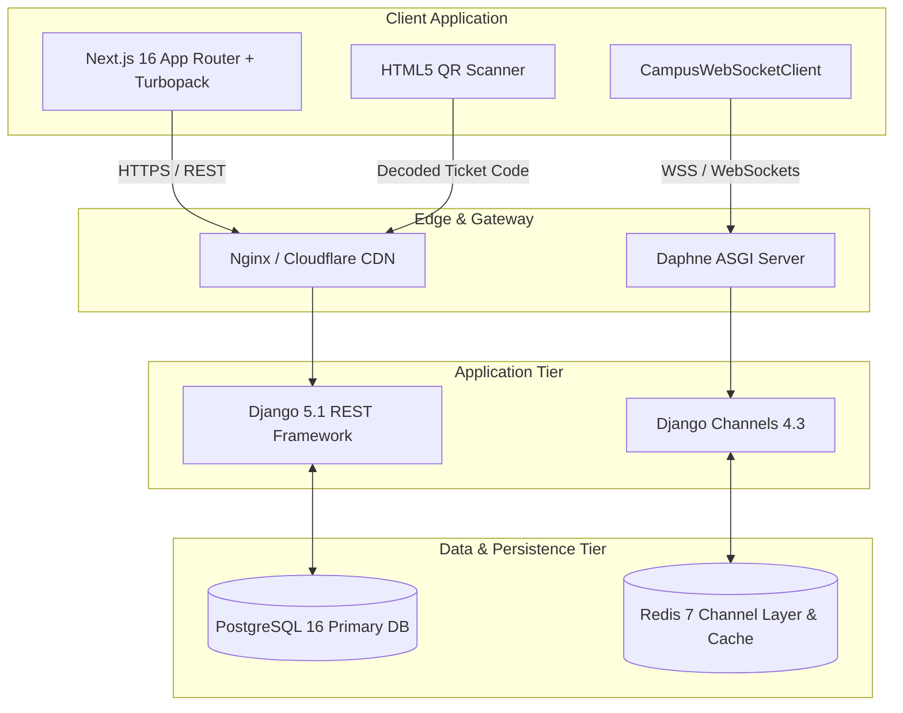

# 🎓 CampusHub

> **Enterprise-Grade Modern College Community, Real-Time Event Platform & QR Attendance Suite**  
> A portfolio-ready full-stack academic platform built with Next.js 16 (Turbopack), Django 5.1 REST Framework, Django Channels 4.3 (ASGI), PostgreSQL, and Redis.

[](https://nextjs.org/)
[](https://www.typescriptlang.org/)
[](https://tailwindcss.com/)
[](https://www.djangoproject.com/)
[](https://channels.readthedocs.io/)
[](https://www.postgresql.org/)
[](https://redis.io/)
[](LICENSE)

---

## 1. Project Overview & Problem Statement

University student life is fragmented across scattered chat groups, disjointed bulletin boards, paper event tickets, and uncoordinated club spreadsheets. Important academic alerts get lost in student inboxes, popular hackathons suffer chaotic overbooking lines, and club leaders lack modern check-in tooling.

**CampusHub** solves this with a unified, real-time college portal:
- **Centralized Event Discovery & Concurrency-Safe RSVP**: Atomic capacity locking prevents overbooking; FIFO automated waitlist promotions elevate students the instant a seat opens.
- **Student Organizations & Live Community Chat**: Verified student societies with leader management dashboards and private real-time WebSocket chat.
- **Interactive Event Q&A**: Live attendee questions, community upvoting, and verified organizer responses.
- **Vector QR-Code Event Tickets & Live Scanner**: Cryptographically unguessable digital passes with camera check-in, duplicate detection, and live organizer attendance dashboards.
- **Targeted Campus Bulletins**: Priority-tiered announcements targeted by department and graduation year cohorts.

---

## 2. Technical Architecture



---

## 3. Technology Stack

| Layer | Technologies |
|---|---|
| **Frontend Framework** | Next.js 16 (App Router, Turbopack, React 19) |
| **Language & Typing** | TypeScript 5 (Strict Mode) |
| **Styling & UI Tokens** | Tailwind CSS 4, Lucide React, CSS Variables |
| **Backend Framework** | Django 5.1, Django REST Framework 3.15 |
| **Real-Time & ASGI** | Django Channels 4.3, Daphne 4.2 |
| **Primary Database** | PostgreSQL 16 (with SQLite local fallback) |
| **Channel Layer & Cache**| Redis 7 (`channels-redis` 4.3) |
| **Authentication** | JSON Web Tokens (`djangorestframework-simplejwt`) with Token Rotation |
| **QR Code Engine** | Python `qrcode` (SVG Vector Generation) & `html5-qrcode` (Client Scanner) |
| **Containerization** | Docker Compose (PostgreSQL + Redis + Daphne Backend + Next.js Frontend) |

---

## 4. Key Platform Features

### 4.1 Real-Time Community & WebSockets
- **Club Community Chat**: WebSocket channel rooms scoped strictly to approved club members with real-time message broadcasting and soft-deletion.
- **Event Q&A Stream**: Live questions, student upvotes, and pinned official organizer answers.
- **Live Attendance Dashboard**: Real-time attendee counter, check-in percentage, and live check-in feed pushed over WebSockets directly to the organizer.

### 4.2 Cryptographic QR Tickets & Check-In
- Guaranteed unique ticket codes (`CH-TKT-<hex12>`) generated with Python's CSPRNG `secrets` module.
- High-contrast SVG vector QR codes rendered directly on client ticket passes (`/dashboard/tickets`).
- Mobile camera scanner (`/events/<id>/check-in`) with real-time validation:
  - Valid ticket check-in (`200 OK`)
  - Duplicate scan warning (`200 OK { duplicate: true }`)
  - Cross-event mismatched ticket prevention (`400 Bad Request`)
  - Forged ticket code rejection (`404 Not Found`)

### 4.3 Concurrency-Safe RSVP & Auto-Promoting Waitlist
- Wrapped in database transactions with `select_for_update()` row-level locks.
- Real-time seat allocation guaranteed under high-concurrency race conditions.
- FIFO automatic waitlist queue: when an attendee cancels, the earliest waitlisted student is promoted instantly, issued a new QR ticket, and notified automatically.

---

## 5. Documented Demo Accounts

CampusHub includes a deterministic demo seeding management command:
```bash
python manage.py seed_demo
```

| Role | Email | Password | Pre-Configured Access |
|---|---|---|---|
| **Student** | `student@campushub.edu` | `CampusDemo2026!` | Active Hackathon RSVP, Waitlist position #1, QR ticket ready |
| **Club Leader** | `leader@campushub.edu` | `CampusDemo2026!` | President of Robotics Club, Event Organizer, Ticket Scanner |
| **Administrator** | `admin@campushub.edu` | `CampusDemo2026!` | College Administrator, Campus Announcement Manager, Full Superuser |

---

## 6. Quick Start & Local Development

### 6.1 Prerequisites
- Python 3.11+
- Node.js 20+
- PostgreSQL 16 & Redis 7 (or Docker)

### 6.2 Backend Setup
```bash
cd backend
python -m venv venv
# Windows:
venv\Scripts\activate
# macOS/Linux:
source venv/bin/activate

pip install -r requirements.txt
python manage.py migrate
python manage.py seed_demo
python manage.py runserver 0.0.0.0:8000
```

### 6.3 Frontend Setup
```bash
cd frontend
npm install
npm run dev
# App will be accessible at http://localhost:3000
```

---

## 7. Docker Multi-Container Deployment

Spin up the complete 4-tier stack in one command:
```bash
docker compose up -d --build
docker compose exec backend python manage.py migrate
docker compose exec backend python manage.py seed_demo
```

| Service | Container Name | Port |
|---|---|---|
| **Frontend** | `campushub_frontend` | `http://localhost:3000` |
| **Backend API (Daphne ASGI)** | `campushub_backend` | `http://localhost:8000` |
| **PostgreSQL 16** | `campushub_db` | `localhost:5432` |
| **Redis 7** | `campushub_redis` | `localhost:6379` |

---

## 8. Verification & Test Suite

### Automated Backend Tests (77 total tests)
```bash
python manage.py test users campus core -v 2
python manage.py test campus.test_security -v 2
python manage.py check
python manage.py makemigrations --check
```

### Automated Frontend Verification
```bash
cd frontend
npm run lint    # 0 errors, 0 warnings
npm run build   # Next.js optimized production build
```

---

## 9. Comprehensive Documentation Index

- [Architecture Specification (ARCHITECTURE.md)](docs/ARCHITECTURE.md)
- [API Specification & Endpoints (API.md)](docs/API.md)
- [API Security & RBAC Matrix (API_SECURITY.md)](docs/API_SECURITY.md)
- [Performance & Database Optimization Guide (PERFORMANCE.md)](docs/PERFORMANCE.md)
- [Observability, Health Checks & Logging (OBSERVABILITY.md)](docs/OBSERVABILITY.md)
- [Final Production Verification & Deployment Report (FINAL_PRODUCTION_REPORT.md)](FINAL_PRODUCTION_REPORT.md)
- [Production Audit Report (PRODUCTION_AUDIT.md)](docs/PRODUCTION_AUDIT.md)
- [Deployment & Cloud Runbook (DEPLOYMENT.md)](docs/DEPLOYMENT.md)

---

## 10. License

This project is licensed under the MIT License — see the [LICENSE](LICENSE) file for details.
