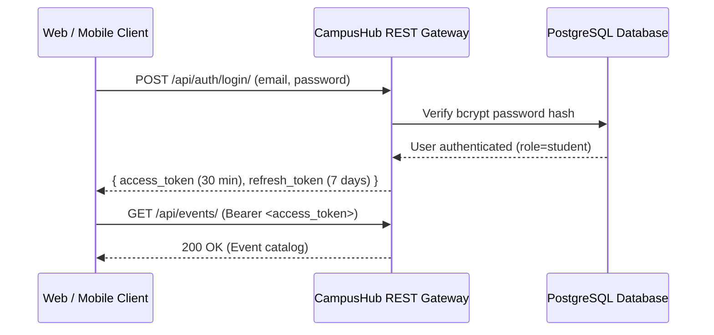

# CampusHub — API Security & Access Control Specification

## 1. Authentication & Session Architecture

CampusHub implements **Stateless JWT (JSON Web Tokens)** using `djangorestframework-simplejwt`.

### 1.1 Token Configuration & Rotation
- **Access Token TTL**: 30 minutes (`JWT_ACCESS_TOKEN_MINUTES=30`).
- **Refresh Token TTL**: 7 days (`JWT_REFRESH_TOKEN_DAYS=7`).
- **Rotation**: `ROTATE_REFRESH_TOKENS=True` issues a brand new refresh token whenever an access token is refreshed.
- **Blacklisting**: `BLACKLIST_AFTER_ROTATION=True` invalidates old refresh tokens immediately, preventing token reuse.

---

## 2. Role-Based Access Control (RBAC) Matrix

| Endpoint | Method | Public / Anonymous | Student | Club Leader | Administrator |
|---|---|---|---|---|---|
| `/api/auth/register/` | `POST` | Allowed | Allowed | Allowed | Allowed |
| `/api/auth/login/` | `POST` | Allowed | Allowed | Allowed | Allowed |
| `/api/events/` | `GET` | Published only | Published only | Published + Drafts | All |
| `/api/events/` | `POST` | Denied (`401`) | Denied (`403`) | Permitted | Permitted |
| `/api/events/<id>/` | `PATCH/DELETE`| Denied (`401`) | Denied (`403`) | Creator only | Permitted |
| `/api/events/<id>/rsvp/`| `POST/DELETE`| Denied (`401`) | Permitted | Permitted | Permitted |
| `/api/events/<id>/check-in/`| `POST` | Denied (`401`) | Denied (`403`) | Event Organizer | Permitted |
| `/api/events/<id>/attendance/`| `GET` | Denied (`401`) | Denied (`403`) | Event Organizer | Permitted |
| `/api/clubs/` | `POST` | Denied (`401`) | Permitted | Permitted | Permitted |
| `/api/clubs/<id>/` | `PATCH/DELETE`| Denied (`401`) | Denied (`403`) | Club Leader only | Permitted |
| `/api/clubs/<id>/chat/` | `GET/WS` | Denied (`401`) | Approved Member | Approved Member | Permitted |
| `/api/announcements/` | `POST` | Denied (`401`) | Denied (`403`) | Denied (`403`) | Permitted |
| `/api/notifications/` | `GET` | Denied (`401`) | Scoped to User | Scoped to User | Scoped to User |

---

## 3. Threat Mitigation & Injection Protections

1. **SQL Injection**: All database interactions use Django's ORM parameterized queries. Raw SQL with parameter interpolation is strictly prohibited.
2. **Cross-Site Scripting (XSS)**: Next.js automatically escapes JSX interpolations. Backend enforces `SECURE_BROWSER_XSS_FILTER=True` and `SECURE_CONTENT_TYPE_NOSNIFF=True`.
3. **Cross-Site Request Forgery (CSRF)**: CSRF tokens enforced for session-based operations; `CSRF_TRUSTED_ORIGINS` strictly controls authorized origins.
4. **Clickjacking Prevention**: `X_FRAME_OPTIONS = 'DENY'` blocks rendering within external iframes.
5. **Brute Force Defenses**: Password hashing uses PBKDF2 with SHA-256 (Django default 720,000 iterations).

---

## 4. Cryptographic Ticket Validation

Event tickets utilize unguessable hex codes (`CH-TKT-<hex12>`) generated using Python's `secrets` cryptographically secure pseudorandom generator.
- QR codes encode verifiable verification strings with HMAC event-user signatures.
- Replay and duplicate scans are rejected server-side with `ALREADY_CHECKED_IN` warning payloads.
- Tickets belonging to a different event cannot be redeemed (`WRONG_EVENT` rejection).
