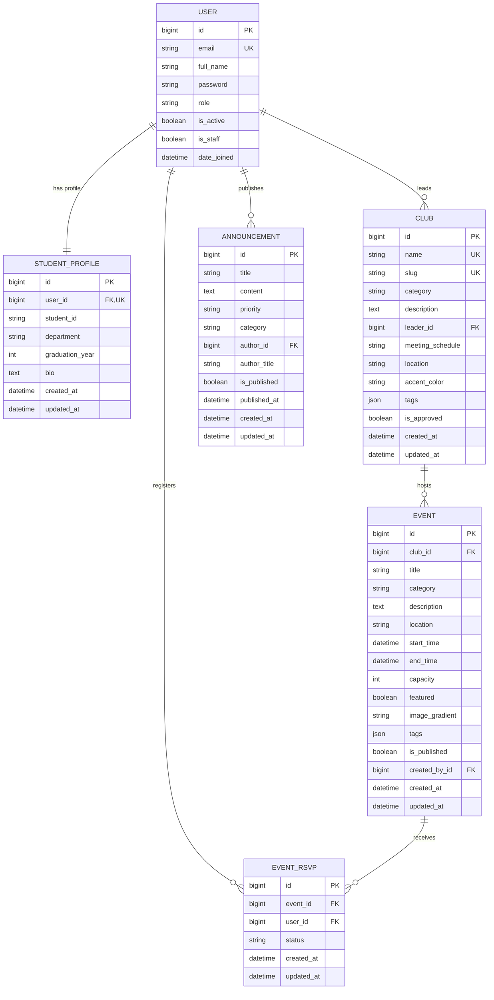
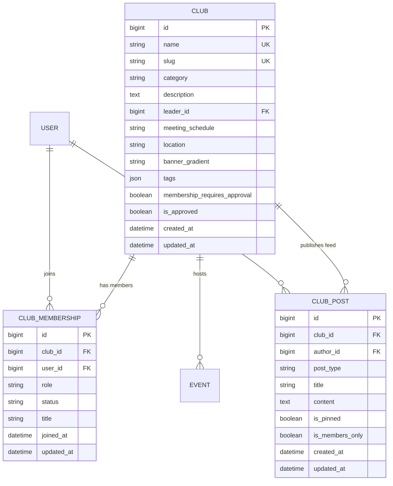
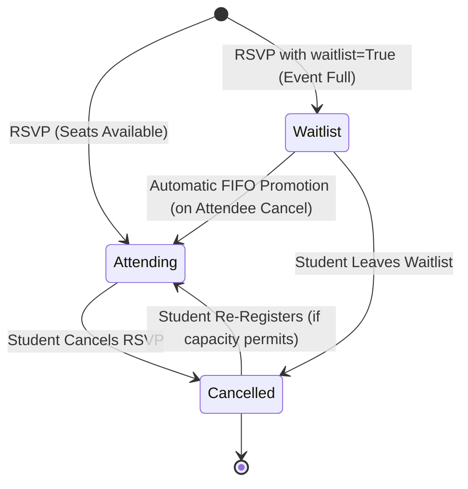
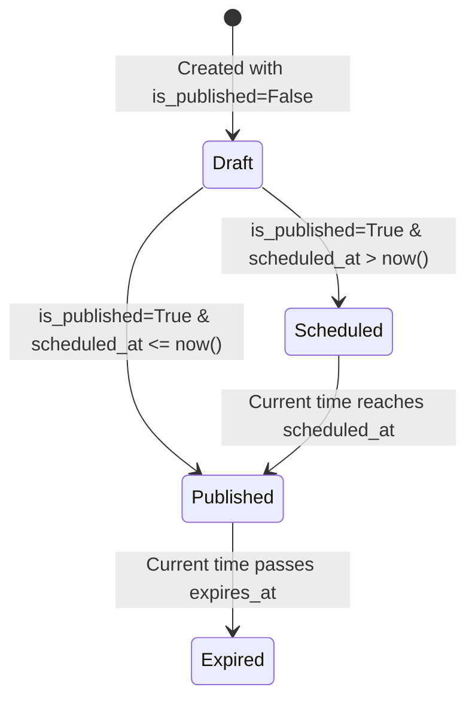

# CampusHub System Architecture

## 1. System Overview
CampusHub is a centralized college community and real-time event management platform designed to connect students with campus activities, student organizations, and official administration announcements.

The platform follows an enterprise decoupled full-stack architecture:
- **Frontend**: Next.js 16 (App Router + Turbopack) + React 19 + TypeScript + Tailwind CSS v4
- **Backend API & WebSockets**: Django 5.1 + Django REST Framework + Django Channels 4.3 + Daphne (ASGI)
- **Real-Time & Cache Layer**: Redis 7 (`channels-redis` 4.3)
- **Database**: PostgreSQL 16 (with automatic SQLite fallback for isolated local development)
- **Containerization & CI/CD**: Docker Compose (4 containers) + GitHub Actions CI

```
+-------------------------------------------------------------+
|                      Client Browser                         |
|   (Desktop, Tablet, Mobile - Responsive Next.js 16 App)     |
+------------------------------+------------------------------+
                               | HTTPS / WSS (JWT Bearer)
                               v
+-------------------------------------------------------------+
|                    Next.js Frontend (Port 3000)             |
|   - Server & Client Components (App Router)                 |
|   - AuthProvider (Context managing JWT & session state)     |
|   - Live Club Chat & Event Q&A WebSocket Clients            |
|   - Mobile HTML5 QR Code Ticket Scanner                     |
|   - Custom Branded 404, 500, and Global Error Boundaries    |
|   - Tailwind CSS Design System & Theme Engine               |
+------------------------------+------------------------------+
                               | REST API & WebSockets
                               v
+-------------------------------------------------------------+
|          Daphne ASGI Server / Django 5.1 (Port 8000)         |
|   - HTTP Gateway: Django REST Framework Views               |
|   - WebSocket Gateway: Channels Consumers (/ws/*)           |
|   - Multi-Service Health System (/api/health/, /ping/)       |
|   - Token Blacklisting, Row Locks, and Cryptographic Tickets|
+-------------------+--------------------+--------------------+
                    |                    |
       Channel Layer|                    |Database Adapter
                    v                    v
+-----------------------+     +-------------------------------+
|     Redis 7 Cache     |     |     PostgreSQL 16 Database    |
|  - Channel Groups     |     |  - Custom User & Profiles     |
|  - Chat broadcasts    |     |  - Clubs, Events, RSVPs       |
|  - Attendance updates |     |  - Announcements, Notifs      |
|  - Q&A live push      |     |  - Digital QR Event Tickets   |
+-----------------------+     +-------------------------------+
```

---

## 2. Directory Layout (Monorepo)
```
campusHub/
├── .github/                      # CI/CD GitHub Actions workflows
│   └── workflows/                # backend.yml, frontend.yml, deploy.yml
├── frontend/                     # Next.js 16 frontend application
│   ├── src/
│   │   ├── app/                  # App Router pages, error boundaries, layout
│   │   ├── components/           # UI, layout, and landing section components
│   │   ├── context/              # AuthProvider React Context
│   │   ├── lib/                  # API & WebSocket client
│   │   ├── types/                # TypeScript interfaces
│   │   └── data/                 # Collegiate sample datasets
│   ├── public/                   # Static assets & icons
│   ├── Dockerfile                # Multi-stage production container
│   ├── tsconfig.json             # TypeScript compiler configuration
│   └── .env.example              # Frontend environment template
│
├── backend/                      # Django REST + Channels backend
│   ├── campushub/                # Project root configuration (settings, asgi, wsgi)
│   ├── users/                    # Authentication and Student Profiles
│   ├── campus/                   # Campus Domain Models, APIs, Consumers, Commands
│   │   ├── models.py             # Club, Event, RSVP, Ticket, Message, Question
│   │   ├── consumers.py          # WebSocket Consumers (Chat, Q&A, Attendance)
│   │   ├── routing.py            # WebSocket URL routing
│   │   ├── test_security.py      # Automated 13-scenario security test suite
│   │   └── management/commands/  # seed_demo.py, seed_events.py, send_event_reminders.py
│   ├── core/                     # Multi-service health checks & system utilities
│   ├── Dockerfile                # Production Daphne container
│   ├── requirements.txt          # Python dependencies
│   └── .env.example              # Backend environment template
│
├── docs/                         # Technical documentation suite
│   ├── ARCHITECTURE.md           # This document
│   ├── API.md                    # REST & WebSocket API specification
│   ├── API_SECURITY.md           # RBAC matrix and security specifications
│   ├── PERFORMANCE.md            # Query plans, indexes, N+1 elimination
│   ├── OBSERVABILITY.md          # Health probes and structured logging
│   ├── PRODUCTION_AUDIT.md       # Pre-flight audit findings and remediations
│   ├── DEPLOYMENT.md             # Docker Compose, Railway, and Vercel guide
│   └── screenshots/              # Portfolio visual evidence
├── docker-compose.yml            # 4-tier orchestration (Postgres, Redis, Backend, Frontend)
└── README.md                     # Open-source showcase and quickstart guide
```

---

## 3. Database Architecture & Models



### Constraints & Integrity Safeguards:
- **`unique_user_event_rsvp` Constraint**: A composite `UniqueConstraint(fields=['event', 'user'])` enforces that a student cannot submit duplicate RSVPs to the same event.
- **Index Optimization**:
  - `Event`: composite indices on `(start_time, is_published)` and `(category, is_published)`.
  - `Club`: composite index on `(category, is_approved)`.
  - `Announcement`: indexed on `priority` and `published_at`.
- **Configurable Student Email Domains**:
  - Controlled by `ALLOWED_STUDENT_EMAIL_DOMAINS` in settings.
  - Ensures institutions can restrict registration to `.edu` or custom university domains, while permitting open access in development or multi-campus deployments.

---

## 4. Authentication Architecture (SimpleJWT)
- **Token Mechanism**: Standard JSON Web Tokens signed with HS256.
- **Token Lifetime**:
  - Access Token: 60 minutes.
  - Refresh Token: 7 days.
- **Rotation & Invalidation**:
  - Refresh token rotation is enabled (`ROTATE_REFRESH_TOKENS = True`).
  - On `/api/auth/logout/`, the submitted refresh token is added to the `token_blacklist` table, immediately revoking its capability to produce new access tokens.
- **Client Session Management**:
  - Frontend `AuthProvider` maintains session in `localStorage`.
  - Auto-hydrates user data on page load using `/api/auth/me/`.
  - Silently refreshes expired access tokens.

---

## 5. Event Management & Concurrency Architecture (Phase 3)

### 5.1 Concurrency-Safe RSVP Transaction Engine
To prevent race conditions during high-demand event registration (e.g. popular hackathons or guest lectures), the RSVP system uses database row-level locking:

```python
with transaction.atomic():
    # Lock the event row until transaction commits
    event = Event.objects.select_for_update().get(pk=pk)

    if event.has_started:
        raise ValidationError("Cannot RSVP to an event that has already started.")

    # Compute confirmed attendees inside lock
    active_count = event.rsvps.filter(status='attending').count()
    if active_count >= event.capacity:
        raise ValidationError("This event is already at full capacity.")

    # Re-activate or create RSVP
    rsvp, created = EventRSVP.objects.get_or_create(
        event=event,
        user=request.user,
        defaults={'status': 'attending'}
    )
    if not created:
        if rsvp.status == 'attending':
            raise ValidationError("You are already registered for this event.")
        rsvp.status = 'attending'
        rsvp.save()
```

### 5.2 Business Rules & Invariants Enforced:
1. **Duplicate RSVP Rejection**: Guaranteed at both database level (`UniqueConstraint(event, user)`) and application level.
2. **Started/Concluded Event Lockout**: Students cannot RSVP or cancel RSVPs once an event's `start_time` has elapsed.
3. **Capacity Non-Negativity & Lower Bound**: `capacity >= 1` enforced via `MinValueValidator(1)`. Furthermore, organizers cannot decrease capacity below existing confirmed attendees.
4. **Time Order Invariant**: Model-level `clean()` and DRF serializer validation enforce `end_time > start_time`.
5. **Attendee Privacy**: Sensitive attendee student rosters (`/api/events/<id>/attendees/`) are strictly restricted to the event creator, club leaders, or campus administrators.

### 5.3 Permission Hierarchy:
- **`CanCreateEvent`**: User must be authenticated and have role `club_leader`, `admin`, `is_staff`, or be the leader of an approved club.
- **`IsEventOrganizerOrAdmin`**: Only the event creator (`created_by`), host club leader, or an administrator can edit or delete an event.
- **`CanViewAttendees`**: Roster inspection restricted to authorized event managers.

### 5.4 Frontend Architecture:
- **`/events`**: Server & Client discovery experience with debounced search, category filter pills, upcoming filter toggle, and pagination.
- **`/events/[id]`**: Detail view with live capacity bar, real-time seat availability, and stateful `RSVPButton`.
- **`/events/create` & `/events/[id]/edit`**: Form management for organizers with client and server error handling, date picker validation, and safe deletion.
- **`/dashboard/events`**: Student portal for viewing active vs. past registrations and quick self-service RSVP cancellation.

---

## 6. Clubs & Community Hub Architecture (Phase 4)

### 6.1 Entity-Relationship Additions


### 6.2 Membership Roles & States
1. **Roles**:
   - `member`: General student member with access to member-only discussions, feeds, and resources.
   - `moderator`: Committee member or community moderator with ability to remove posts and moderate discussions.
   - `vice_president`: Executive officer with member approval and event creation authority.
   - `president`: Senior club leader with full management rights, role assignment, and club information editing.
2. **States**:
   - `pending`: Application submitted by student, awaiting review by club officers.
   - `approved`: Active club member with verified permissions.
   - `rejected`: Application denied or membership revoked. Retains zero member-only access.

### 6.3 Business Rules & Server-Side Security Invariants:
1. **Duplicate Prevention**: `UniqueConstraint(fields=['club', 'user'], name='unique_club_user_membership')` prevents duplicate application or membership records.
2. **Anti Self-Approval Guard**: Leaders and officers cannot approve their own membership applications (`membership.user == request.user` returns HTTP 400).
3. **Primary Leader Retention**: A club's primary leader (`club.leader == request.user`) cannot abandon the club without transferring leadership or deleting the club.
4. **Member Privacy**: Contact information (student IDs, emails) is only exposed to verified leaders and admins (`ClubMembersView` serializes sanitized public cards for standard users).
5. **Post Author & Moderator Boundaries**: Authors can edit and delete their own posts; club leaders, moderators, and platform admins can delete or moderate any inappropriate content.

---

## 7. Event Waitlist Architecture & State Machine

### 7.1 Waitlist Lifecycle & Transition Diagram


### 7.2 Concurrency-Safe Automatic FIFO Promotion
When an attendee cancels their RSVP, the transaction atomic block detects if waitlisted candidates exist and automatically promotes the earliest candidate:

```python
with transaction.atomic():
    event = Event.objects.select_for_update().get(pk=pk)
    
    # Cancel current attendee
    rsvp.status = 'cancelled'
    rsvp.save()
    
    # Check if eligible waitlisted student exists (FIFO: earliest created_at)
    next_waitlisted = event.rsvps.filter(status='waitlist').order_by('created_at').first()
    if next_waitlisted:
        next_waitlisted.status = 'attending'
        next_waitlisted.save()
        promoted_user = next_waitlisted.user
```

### 7.3 Frontend Waitlist Experience:
- **Full Event View**: When capacity is reached (`available_seats == 0`), the RSVP button transitions to an amber `"Join Waitlist"` button.
- **Active Waitlist State**: Displays `"Leave Waitlist"` with position badge.
- **Instant Promotion**: Upon cancellation by another student, the waitlisted student's record transitions to `attending`, and their UI renders `"Registered ✓"`.

---

## 8. Announcement Lifecycle & Targeting Architecture

### 8.1 Announcement Data Model & State Machine
The `Announcement` model supports a complete administrative publication lifecycle:


### 8.2 Audience Targeting Rules
Announcements can be targeted using fine-grained criteria:
1. `everyone`: Delivered and visible to the entire university community.
2. `department`: Evaluated against `user.student_profile.department` (case-insensitive substring match).
3. `graduation_year`: Evaluated against `user.student_profile.graduation_year`.
4. `both`: Requires matching both the department and the graduation year cohort.

Public, unauthenticated requests only receive public active announcements targeted to `everyone`. Staff and administrator accounts bypass student targeting filters to manage the full portfolio of campus notices.

---

## 9. Notification Architecture & Trigger Engine

### 9.1 Notification Delivery Engine
The `campus.notifications` module provides a centralized, idempotent notification dispatch pipeline:
```
+---------------------------+
|    Application Trigger    |
| (RSVP / Waitlist / Clubs) |
+-------------+-------------+
              |
              v
+---------------------------+
|  User Preference Guard   | ---> [Disabled] --> Discard
+-------------+-------------+
              | [Enabled]
              v
+---------------------------+
| Deduplication Checker     | ---> [Duplicate within window] --> Skip
| (Window: 5-15 min)        |
+-------------+-------------+
              | [Fresh]
              v
+---------------------------+
| Database In-App Record    | (Indexed: recipient + is_read, recipient + created_at)
+-------------+-------------+
              |
              v
+---------------------------+
| Email Dispatch Pipeline   | ---> [dev: console backend] / [prod: SMTP / SendGrid]
+---------------------------+
```

### 9.2 Automatic Triggers Matrix
| Event / Action | Notification Type | Trigger Condition | Idempotency Key / Window |
|---|---|---|---|
| **Club Application Approved** | `club_application_approved` | Leader approves pending membership | Recipient + Club |
| **Club Application Rejected** | `club_application_rejected` | Leader denies pending application | Recipient + Club |
| **Event RSVP Confirmed** | `event_rsvp` | Student claims open capacity seat | Recipient + Event |
| **Waitlist Joined** | `event_rsvp` | Student joins queue for full event | Recipient + Event |
| **Waitlist Auto-Promoted** | `waitlist_promotion` | Attendee cancels seat; next waitlisted student promoted | Recipient + Event |
| **Club Feed Post** | `club_post` | Leader/officer creates member announcement | Recipient + Club + Post |
| **Campus Announcement** | `announcement` | Admin publishes targeted announcement | Recipient + Announcement |
| **Event Reminders** | `event_reminder` | 24h and 1h prior to event start for active RSVPs | Recipient + Event + Window |

### 9.3 In-App Notification Center
- **Navbar Bell**: Live badge counter reflecting unread notifications (`/api/notifications/unread-count/`).
- **Interactive Quick Panel**: Real-time dropdown showing the latest 5 unread alerts, instant mark-as-read, and deep links to related entities.
- **Dedicated Hub (`/notifications`)**: Tabbed interface (`All`, `Unread`, `Read`), individual and bulk read actions, deletion, and empty states.
- **Granular User Preferences (`/dashboard/settings/notifications`)**: Student controls for each notification category, with immediate persistence to the database.

---

## 10. Email Architecture & Scheduled Reminder Engine

### 10.1 Production Email Delivery Architecture
CampusHub separates notification persistence from email delivery:
- **Environment Driven**: Zero hardcoded credentials. Configured via `EMAIL_HOST`, `EMAIL_PORT`, `EMAIL_HOST_USER`, `EMAIL_HOST_PASSWORD`, and `DEFAULT_FROM_EMAIL`.
- **Development Fallback**: When `EMAIL_HOST_USER` is unspecified, Django safely defaults to `django.core.mail.backends.console.EmailBackend`, printing structured multipart HTML and plain-text emails to stdout for rapid development and testing.
- **HTML & Plain Text Templates**: Every notification email includes a brand-compliant responsive HTML card and clean fallback text.

### 10.2 Event Reminder Architecture (`send_event_reminders`)
Automated pre-event reminders are handled via a maintainable Django management command:
```bash
python manage.py send_event_reminders [--dry-run]
```
- **Execution Windows**:
  - **24-Hour Reminder**: Scans events starting between `now + 23h` and `now + 25h`.
  - **1-Hour Reminder**: Scans events starting between `now + 45m` and `now + 75m`.
- **Eligibility Guard**: Only users with active `status='attending'` RSVPs receive reminders. Cancelled or waitlisted registrations are strictly excluded.
- **Idempotency Guarantee**: Reminders check existing notifications within the trigger window, preventing duplicate emails during repeated cron runs.

