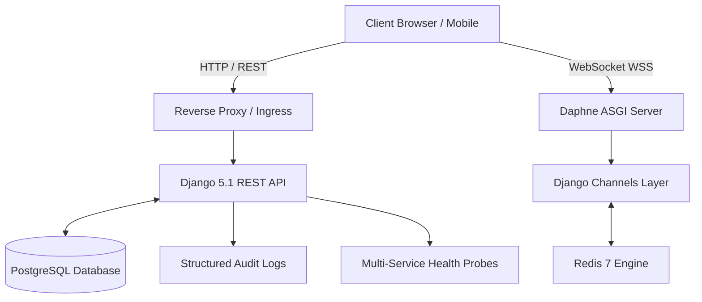

# CampusHub — Observability, Health Monitoring & Logging Guide

## 1. Observability Architecture

CampusHub implements a comprehensive observability architecture across the API, database, real-time WebSocket infrastructure, and client applications.



---

## 2. Health Monitoring Endpoints

### 2.1 Full System Health Probe: `GET /api/health/`
The health check probe runs live diagnostics against all critical dependencies without exposing sensitive internal network addresses or credentials.

**Response Schema (`200 OK` - Healthy):**
```json
{
  "status": "healthy",
  "app": "CampusHub API",
  "version": "1.0.0",
  "checks": {
    "api": "operational",
    "database": {
      "status": "connected",
      "engine": "sqlite3",
      "latency_ms": 1.42
    },
    "channel_layer": {
      "status": "in_memory_ready",
      "type": "in_memory"
    },
    "email_service": {
      "backend": "EmailBackend",
      "tls": true
    }
  },
  "uptime_seconds": 1842.15,
  "timestamp": "2026-09-21T08:24:00.123456+00:00"
}
```

### 2.2 Status Classifications
- **`healthy` (`200 OK`)**: Database connected with sub-50ms latency; WebSocket channel layer responsive.
- **`degraded` (`200 OK`)**: Database operational, but an optional subsystem (e.g. email or Redis cache layer) is temporarily unreachable.
- **`unhealthy` (`503 Service Unavailable`)**: Database connection failed or primary API storage offline. Load balancers immediately remove the instance from the rotation.

### 2.3 Lightweight Liveness Probe: `GET /api/health/ping/`
High-frequency ping probe for container orchestration (Kubernetes liveness, Docker healthchecks, AWS ALB).
```json
{
  "status": "pong",
  "service": "campushub-api",
  "timestamp": "2026-09-21T08:24:00.123456+00:00"
}
```

---

## 3. Structured Application Logging

Logging is configured via Python's standard `logging` dict with structured output format:
`[{asctime}] {levelname} [{name}:{lineno}] {message}`

### 3.1 Security & Audit Events (`campushub.audit`)
CampusHub logs security-critical events with contextual metadata:
- **Authentication**: Successful logins, token refresh rotations, and failed authentication attempts.
- **Check-In Verification**: Ticket scans, duplicate scan alerts, and unauthorized scanner attempts.
- **Waitlist & Capacity**: Automated promotions, oversubscription limits, and cancellations.
- **Administrative Actions**: Club approvals, announcement publication, and permission alterations.

### 3.2 Sensitive Data Redaction Rules
Strict filters prevent writing the following to logs:
1. User raw passwords and bcrypt hashes.
2. JWT secret keys and raw signature tokens.
3. Database and Redis connection passwords.
4. SMTP credentials.

---

## 4. Debugging & Incident Response Runbook

1. **Verify Liveness**: `curl -f http://localhost:8000/api/health/ping/`
2. **Inspect Deep Health**: `curl -s http://localhost:8000/api/health/ | jq .`
3. **Inspect WebSocket Logs**: Check Daphne process logs for `WebSocket CONNECT /ws/... [accepted]` or disconnection error codes.
4. **Database Verification**: Run `python manage.py check --database default` to test migrations and active connections.
